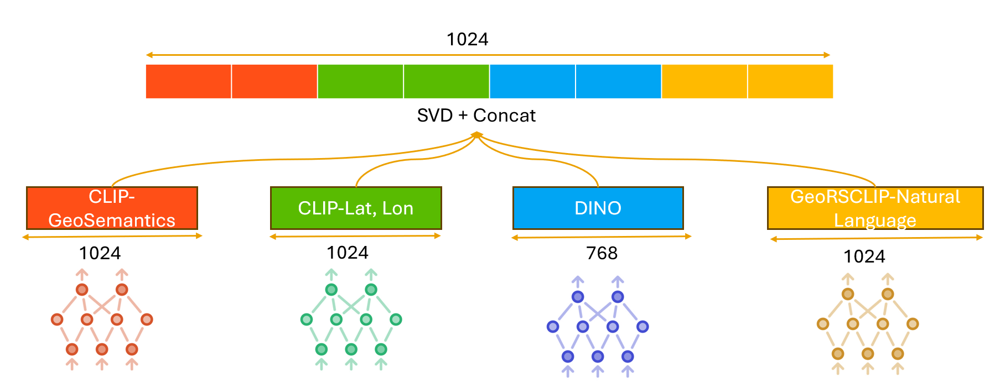
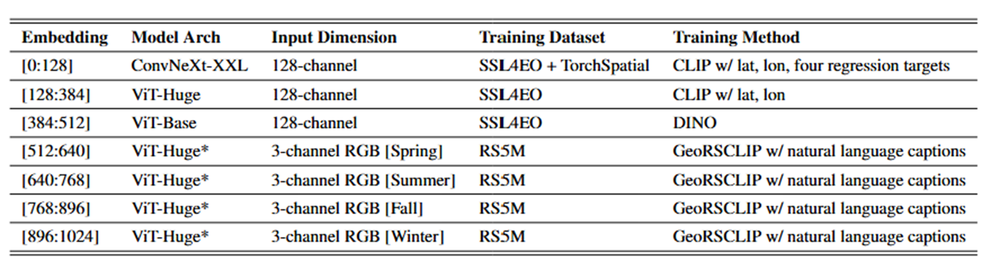

# 2025 EarthVision Embed2Scale Challenge Winning Solution



This repo contains the code for the first place solution to the [Embed2Scale Challenge](https://eval.ai/web/challenges/challenge-page/2465/overview) for the [2025 CVPR Earthvision Workshop](https://www.grss-ieee.org/events/earthvision-2025/?tab=challenge).

## Solution

### Overview
The requirement of data challenge is using encoder to compress SSL4EO-S12 (v1.1) data cubes to 2014 embeddings and can be applied to various downstream task. In order to enable maximum generalization of final embeddings, our solution goal is adapting model ensembling to enhance its geospatial semantics.  
As the figure shows, we ensemble embeddings from four state-of-the-art models and leverage SCD + flat concat to generate final 1024 size embedding.  

### Models

CLIP-Lat,Lon: ViT-based CLIP model that fine-tuned on SSL4EO-S12 (v1.1) training dataset. Since the training data cubes from EO4SSL dataset comes with < lat, lon > metadata. We construct them as string: “Latitute: lat, Longtitute: lon” as one part of the supervision to the CLIP encoder.

CLIP-GeoSemantics: CNN-based CLIP model that fine-tune on SSL4EO-S12 (v1.1) training data and extra metadata. Based on each cube’s location <lat, lon>, we get four attributes from [TorchSpatial](https://github.com/seai-lab/TorchSpatial). And we format the string in the same way: “Forest Cover: x1, Elevation:x2, Nightlights: x3, Population: x4” as the other part of the supervision to the CLIP encoder.

DINO: ViT-based [Self-Supervised Vision Transformers ](https://github.com/facebookresearch/dino) fine-tuned on SSL4EO-S12 v1.1 training dataset.

GeoRSClip-Natural Languange: a [pretrained model](https://github.com/om-ai-lab/RS5M) on RS5M dataset. 


### Final Embedding Ensemble


## Code Instruction

### Environemnt
```bash
conda init
conda env create --name cvpr_comp --file=env.yaml
conda activate cvpr_comp
```
### Download Model Checkpoints

Download four model checkpoints and save in ./ckpts from [here](https://huggingface.co/mrxiaoyuer/earthvision2025_winning_solution/tree/main). 

### GeoRSClip
```bash 
cd ./GEORSCLIP

git clone https://github.com/mlfoundations/open_clip.git
pip install -e open_clip

python embed_georsclip_step1.py --dataset-path /mnt/disk3/SSL4EO_TEST/data_eval --ckpt-path ../ckpts/RS5M_ViT-H-14.pt ##Update all "--dataset-path" and "--ckpt-path" in the run.sh to be absolute paths on your local machine.

python embed_georsclip_cluster_step2.py -i ./georsclip-embeddings-step1.pt -d /mnt/disk3/SSL4EO_TEST/data_eval -o ../submissions/georsclip_submission_512.csv
```
### CLIP Models
```bash 
cd ..

git clone https://github.com/mlfoundations/open_clip.git

# include custom changes here
cp open_clip_custom/convnext_xxlarge.json open_clip/src/open_clip/model_configs/
cp open_clip_custom/ViT-H-14.json open_clip/src/open_clip/model_configs/
cp open_clip_custom/factory.py open_clip/src/open_clip/
cp open_clip_custom/timm_model.py open_clip/src/open_clip/
cp open_clip_custom/transform.py open_clip/src/open_clip/
cp open_clip_custom/transformer.py open_clip/src/open_clip/

pip install -e open_clip
```

```bash
python embed_vitH.py --dataset-path /mnt/disk3/SSL4EO_TEST/data_eval --ckpt-path ./ckpts/epoch_25.pt -o ./submissions/embeddings_clip_VITH_256_E25.csv

python embed_cnxtxxlarge.py --dataset-path /mnt/disk3/SSL4EO_TEST/data_eval --ckpt-path ./ckpts/epoch_22.pt -o ./submissions/embeddings_clip_convnext_xxlarge_256_ftregress_e22.csv
```
### DINO
```bash
python embed_vitb_dino.py --dataset-path /mnt/disk3/SSL4EO_TEST/data_eval --ckpt-path ./ckpts/checkpoint0030.pth -o ./submissions/embedding_vit_base_finetune_epoch0030.csv
```

### Final Embedding
```bash
python final_merge.py
```
## Team Member
- Zirui Xu
- Raphael Tang 
- Mike Bianco
- Qi Zhang
- Nikolaos Karianakis
- Fuxun Yu

